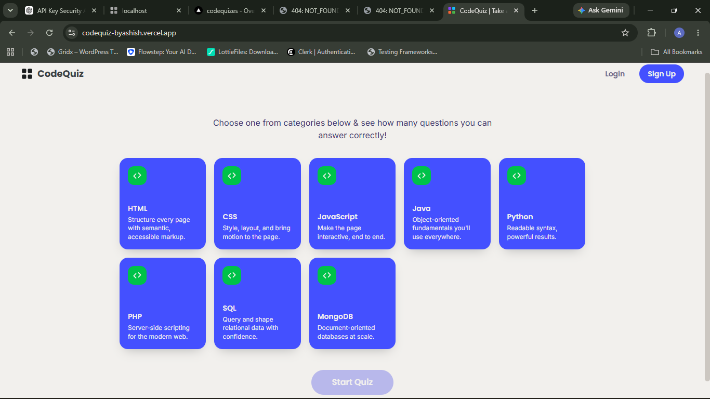
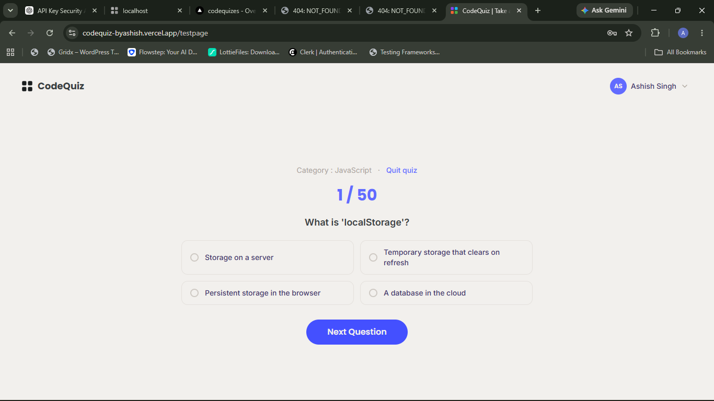
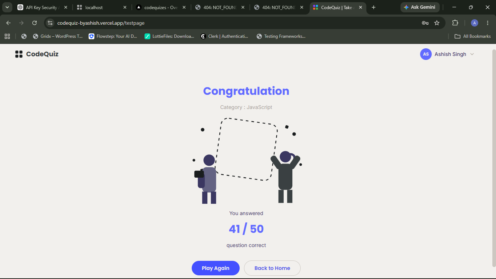
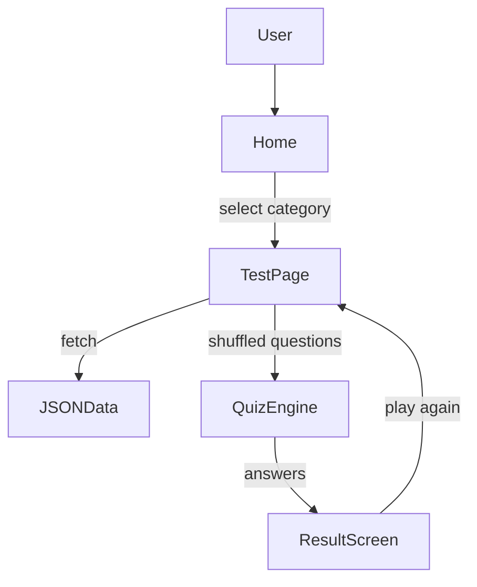
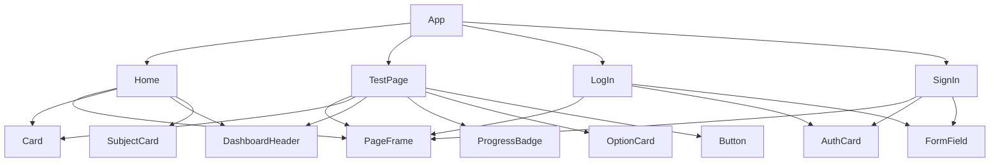

# CodeQuiz

A frontend React quiz application for learning coding topics through category-based multiple-choice questions.

## Overview

CodeQuiz is a browser-based quiz app designed for learners who want to test their knowledge of programming topics. Users can sign up, log in, select a category, answer shuffled questions from JSON data, and review their score on a results screen. The app is built as a modern single-page application using React, React Router, and Tailwind CSS.

### What it does

- Presents subject categories as quiz entry points
- Loads question banks from static JSON files
- Runs a sequential multiple-choice quiz
- Tracks progress and final score
- Requires email/password login to start a quiz
- Uses browser local storage for auth persistence

### Target users

- Students learning web development
- Developers preparing for interviews
- Anyone practicing HTML, CSS, JavaScript, Java, Python, PHP, SQL, and MongoDB

## Features

- Category-based quiz selection
- Email/password sign-up and login
- Local storage authentication persistence
- Multiple-choice questions loaded from JSON
- Shuffled question order for each quiz
- Per-question progress indicator
- Result summary screen with score
- Responsive, mobile-friendly UI
- Toast notifications for user feedback
- Client-side routing using React Router
- Custom reusable UI components

## Live Demo


## Screenshots

### Home Page



### Quiz Screen



### Results Screen



## Tech Stack

Category | Technology
--- | ---
Framework | React
Bundler | Vite
Styling | Tailwind CSS
Routing | React Router
Notifications | React Toastify
Data | JSON files
Storage | Browser Local Storage

## Architecture Overview

### Data Flow



### Component Flow



## Folder Structure

```text
codequiz/
├── public/
│   ├── Images/
│   └── JSON/
│       ├── CSS.json
│       ├── Html.json
│       ├── Java.json
│       ├── JavaScript.json
│       ├── MongoDB.json
│       ├── PHP.json
│       ├── Python.json
│       └── SQL.json
├── src/
│   ├── components/
│   │   ├── AuthCard.jsx
│   │   ├── AuthSwitchBadge.jsx
│   │   ├── Button.jsx
│   │   ├── Card.jsx
│   │   ├── CarouselDots.jsx
│   │   ├── DashboardHeader.jsx
│   │   ├── DotPattern.jsx
│   │   ├── FormField.jsx
│   │   ├── icons.jsx
│   │   ├── Logo.jsx
│   │   ├── OptionCard.jsx
│   │   ├── PageFrame.jsx
│   │   ├── ProgressBadge.jsx
│   │   ├── SocialAuthRow.jsx
│   │   ├── SubjectCard.jsx
│   │   └── UserMenu.jsx
│   ├── data/
│   │   └── subjects.js
│   ├── hooks/
│   │   └── useAuthUser.js
│   ├── illustrations/
│   │   ├── CelebrationIllustration.jsx
│   │   └── QuizHeroIllustration.jsx
│   ├── pages/
│   │   ├── Home.jsx
│   │   ├── LogIn.jsx
│   │   ├── SignIn.jsx
│   │   └── TestPage.jsx
│   ├── utils/
│   │   ├── authStorage.js
│   │   └── quiz.js
│   ├── App.jsx
│   ├── index.css
│   └── main.jsx
├── .gitignore
├── eslint.config.js
├── package.json
├── README.md
├── vercel.json
└── vite.config.js
```

### Important folders

- `src/pages/` — main app screens: home, quiz, login, signup
- `src/components/` — reusable UI building blocks
- `src/data/subjects.js` — quiz category metadata and JSON paths
- `src/utils/` — business logic helpers for quiz scoring and auth
- `public/JSON/` — question banks for each subject category

## Data Structure

Question banks are stored in static JSON files under `public/JSON/`.

### Sample schema

```json
{
  "id": 1,
  "question": "What does HTML stand for?",
  "options": [
    "Hyper Text Markup Language",
    "High Text Machine Language",
    "Hyper Tabular Machine Log",
    "Hyperlink Text Marking Language"
  ],
  "answer": "Hyper Text Markup Language",
  "explanation": "HTML is the standard markup language used to create the structure of web pages."
}
```

### How data moves through the app

- `Home.jsx` maps categories from `src/data/subjects.js`
- A selected category’s `jsonPath` is passed into `TestPage`
- `TestPage.jsx` fetches the JSON file from `/JSON/...`
- `pickQuestions()` shuffles the array
- User answers update the `answers` state array
- `scoreAnswers()` compares user answers to the correct `answer` values

## Installation

### Clone Repository

```bash
git clone <repository-url>
cd codequiz
```

### Install Dependencies

```bash
npm install
```

### Run Development Server

```bash
npm run dev
```

### Build Production Version

```bash
npm run build
```

## Environment Variables

No environment variables are required.

## Component Architecture

The app is composed of reusable presentational and layout components:

- `PageFrame` — full-screen background frame
- `Card` — white content surface
- `DashboardHeader` — top navigation and auth actions
- `SubjectCard` — selectable quiz category tile
- `OptionCard` — multiple-choice answer button
- `ProgressBadge` — quiz progress indicator
- `Button` — shared button styling
- `FormField` — labeled form inputs with password visibility toggle
- `AuthCard` — auth layout container
- `UserMenu` — logged-in user dropdown
- `useAuthUser` — auth state hook
- `authStorage.js` — local storage auth helper
- `quiz.js` — question shuffle and scoring utilities

## Routing Analysis

| Route | Component | Purpose |
|---|---|---|
| `/` | `Home` | Quiz category selection |
| `/testpage` | `TestPage` | Run selected quiz and show results |
| `/signin` | `SignIn` | Register new user |
| `/login` | `LogIn` | Authenticate existing user |

## State Management Analysis

- `useState` — local component state for form values, quiz answers, current question, view mode, and loading/error state
- `useEffect` — lifecycle effects for fetching questions, authentication redirects, and session timeout
- Custom hook `useAuthUser` — syncs localStorage auth state across tabs/windows using `storage` and custom events
- No Redux, Context API, or external state libraries

## Quiz Engine Analysis

### Question loading

- Category selected on Home supplies `jsonPath`
- `TestPage` fetches the JSON file for that category
- Questions are shuffled with `pickQuestions(bank)`

### Option selection

- Each answer option is rendered by `OptionCard`
- User clicks an option to update `answers[currentIndex]`

### Validation logic

- `handleNext()` prevents advancing unless current question has a selected answer
- Toast error shown if user tries to continue without selecting an option

### Score calculation

- `scoreAnswers(questions, answers)` counts matches between user answer and question `answer`
- Score is displayed as `score / totalQuestions`

### Progress tracking

- `ProgressBadge` shows current question index + 1 over total question count
- Quiz advances sequentially through the shuffled question array

### Result generation

- On the final question, `view` switches to `result`
- Result page shows score, category, and buttons to retry or return home

### Pseudocode

```js
questions = fetch(categoryJsonPath)
questions = shuffle(questions)
answers = Array(questions.length).fill(null)
currentIndex = 0

function selectOption(option) {
  answers[currentIndex] = option
}

function nextQuestion() {
  if (!answers[currentIndex]) error("Select an answer")
  else if (currentIndex === questions.length - 1) view = "result"
  else currentIndex += 1
}

function calculateScore() {
  return questions.filter((q, i) => answers[i] === q.answer).length
}
```

## UI/UX Review

- Navigation: intuitive category-first flow with auth gating
- Visual consistency: clean Tailwind-based design with consistent branding
- Accessibility: good use of buttons, form labels, and semantic elements
- Mobile responsiveness: responsive grid and layout adapt to smaller screens
- User experience: clear progress, feedback, and retry flow

Score: **8 / 10**

## Performance Analysis

- Minimal React component tree and state management
- JSON question banks loaded on demand only
- Vite + Tailwind CSS keeps build lightweight
- `fetch()` on quiz entry is fine for static question files

Recommendations:
- Cache loaded question banks for faster replay
- Add lazy loading or code splitting only if app grows much larger
- Use memoization for derived values if quiz logic becomes more complex

## Code Quality Audit

Category | Score | Notes
--- | --- | ---
Folder Structure | 9/10 | Clean separation between pages, components, utils, and data
Readability | 8/10 | Clear naming, concise components, and readable CSS
Reusability | 8/10 | Good reusable button, card, form, and layout components
Maintainability | 8/10 | Logic split into utilities and hooks; easy to extend
Scalability | 7/10 | Solid foundation, though auth and question state are simple and could be extended

## Production Readiness Audit

Category | Score | Justification
--- | --- | ---
Architecture | 7/10 | Good SPA structure but single-tab local auth is simple
Frontend Quality | 8/10 | Clean design, responsive layout, and reusable components
Performance | 8/10 | Lightweight bundle and minimal dependencies
Accessibility | 7/10 | Good semantics; could improve keyboard/menu handling and screen reader text
Scalability | 7/10 | Works well now, but requires backend and persistence for growth
Maintainability | 8/10 | Organized code and clear utility separation

## Missing Features

- Backend integration for secure auth and user data
- Persistent quiz progress / resume support
- Leaderboard or user score history
- Difficulty selector or timed quizzes
- Answer explanation review after each question
- Dark mode theme toggle
- Multi-user account support beyond local storage

## Future Improvements

- Add a backend API for authentication and quiz persistence
- Store quiz progress and history per user
- Add a category/difficulty filter and timed quiz mode
- Show explanations after each answer or on the result page
- Improve accessibility with keyboard menu navigation and ARIA feedback
- Introduce a dark theme option
- Add unit tests for quiz scoring and auth flows
- Add a profile/dashboard page for saved progress

## Developer Skill Assessment

**Estimated level: Intermediate**

Evidence:
- Correct use of React Router for SPA navigation
- Reusable presentational components and shared layout patterns
- Custom hook for auth state synchronization
- Static JSON-driven data loading and scoring utilities
- Areas for growth: secure backend auth, richer state management, and persistence beyond local storage

## Contributing

Thank you for your interest in contributing to CodeQuiz!

- Fork the repository
- Create a new branch for your feature or fix
- Open a pull request with a clear description
- Keep code style consistent with existing components
- Test the flow locally with `npm run dev`

## License

License not specified.
